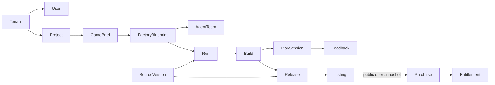

# Cloud domain model, version 1

This is the shared design for AF-CLD-002. It defines records, state changes and
examples for later implementation. It does **not** provide a running Cloud API,
identity provider, payment service, sandbox or playable game. Passing its fixture
tests is engineering evidence for this contract only.

Read the [Core and Cloud boundary](core-cloud-boundary.md) first. Core runs neutral
agent workflows and reports evidence. Cloud owns accounts, access, hosted runs,
publication and commerce. No provider account, subscription or API key silently
grants another provider's capabilities.

The machine-readable [field catalogue](../contracts/v1/domain.json) is a small
project-specific format, not JSON Schema or OpenAPI. The
[transition catalogue](../contracts/v1/transitions.json) defines the state commands
implemented by the reference evaluator. The [API contract](api-contract.md)
defines the wire behavior that a future service must implement.

## Records and ownership

Every internal record has an opaque, globally unique `id`, `tenant_id`, positive
integer `revision`, `state`, timezone-aware `created_at` and `updated_at`, and a
`deleted` flag. A tenant is a personal account or a human team. A User is that
tenant's membership for an external identity, not a global profile exposed to
other teams. An AgentTeam is a set of agent roles, not a human access-control team.

| Record | Meaning and important links | Initial state |
| --- | --- | --- |
| Tenant | Account/team boundary and lifecycle | active |
| User | Identity membership and roles within one tenant | active |
| Project | Creator workspace; owner is a local User | draft |
| GameBrief | Original text, editable requirements and analysis source; belongs to Project | draft |
| FactoryBlueprint | Versioned approved plan, engine packs and target profile; refers to GameBrief | draft |
| AgentTeam | Role-to-profile bindings for a blueprint; contains references, never credentials | active |
| Run | One source version, blueprint, team, workspace and model profile; has an attempt number | draft |
| SourceVersion | Immutable source digest, parent version, source and asset provenance | available |
| Build | One source, run and immutable artifact digest for a named target | pending |
| PlaySession | A user's attempt to play one Build; live and simulation are explicit | created |
| Feedback | Feedback tied to the exact PlaySession and its Project | submitted |
| Release | Candidate binding one SourceVersion and Build, with approval evidence | candidate |
| Listing | Public offer for one Release, price, currency, moderation and rights | draft |
| Purchase | Buyer's immutable public offer snapshot and payment reference | pending |
| Entitlement | Buyer's license for a public release, normally linked to a Purchase | pending |



All internal links stay inside a tenant. Project children must agree on the same
Project. A valid ID from another tenant returns the same 404 as an unknown ID.
The server derives identity, membership and permissions from verified sessions;
client-supplied roles or `tenant_id` fields never establish authority.

Buying and remixing do not grant membership in the seller's tenant. A Purchase
stores a server-verified public offer snapshot: seller tenant, public listing ID
and revision, public release reference, license version, price, currency and an
offer token. The buyer's Entitlement uses that public release reference. It does
not follow a private seller Release foreign key. The fixture validator checks
snapshot shape and price agreement; it does not verify signatures or payment.

For a public remix, first check the published source export and remix permission,
then import a new SourceVersion into the receiving tenant. Keep the public origin
and license in provenance. Its internal parent points only to a version in that
tenant, or is null. Never reference another tenant's private source record.

## Versions and editable input

Keep the submitted brief text and its digest. `analysis_kind` says whether the
proposal came from deterministic rules, AI, or human editing. A parsed proposal
does not mean AI has understood or approved the game. Editing approved input
creates a new version; old runs keep their approved inputs.

The catalogue names immutable fields. A changed source digest needs a new
SourceVersion ID. A rebuilt or retargeted artifact needs a new Build ID. An edited
approved blueprint needs a new blueprint ID. Do not relabel old build evidence
with a new digest. New versions start without inherited approval or readiness.

A Run's `source_version_id` identifies the exact frozen source being evaluated.
If an agent produces changed source, store a new SourceVersion and create its
validation Run before qualifying a Build. The producing run may be recorded in
external provenance evidence; it cannot certify a different source by accident.

## State and recovery rules

| Record | Allowed lifecycle and recovery |
| --- | --- |
| Tenant / User | Suspend or revoke access immediately. Restoration requires an authorized account action; never a heartbeat. |
| Project | draft → active → archived; authorized deletion creates a tombstone. A published Listing must be withdrawn first. |
| GameBrief / FactoryBlueprint | Review draft → approved; replace an approved version by a new version; supersede/retire the old one. |
| AgentTeam | active ↔ paused; retired bindings cannot start new runs. |
| Run | draft → ready → running → succeeded. Missing inputs lead to blocked; execution errors to failed; cancellation is explicit. Retry failed/blocked/cancelled → draft, increment attempt, clear checks. |
| Build | pending → ready only after qualification; missing evidence → blocked, export errors → failed, interrupted work → cancelled. Recheck blocked builds; rebuilding a failed/cancelled artifact uses a new ID. |
| PlaySession | created → active → completed; startup/play errors → failed; cancellation → cancelled. A new play attempt gets a new session. |
| Feedback | submitted → triaged → resolved or dismissed. Resolution does not certify a release. |
| Release | candidate → approved or blocked; recheck blocked candidates. approved/blocked → withdrawn. A replacement release gets a new ID. |
| Listing | draft/blocked → published after release, moderation and rights checks. published/blocked → withdrawn. Withdrawal removes discovery and new sales. |
| Purchase | pending → paid only on a verified payment result; otherwise failed/cancelled. paid → refunded only on verified refund. Never mark paid from a browser redirect. |
| Entitlement | pending → active only from a paid purchase and verified offer. active → suspended/revoked/expired. Restoration needs a fresh authorized decision and a still-valid license. |

Only the state commands in `transitions.json` have an executable reference
implementation in this task. The remaining lifecycle rows are requirements for
their owning future services, not undocumented ways to PATCH a state.

## Evidence gates

Every required proof has a name, passed/failed status, live/simulation mode,
evidence reference, checked time, expiry and exact input binding. A positive gate
needs exactly one current, live, passed proof for each required check. Missing,
duplicate, failed, future-dated, expired or differently bound proofs deny the
transition. A simulation can be shown as a simulation; it cannot prove playability.

| Gate | Required evidence and exact binding |
| --- | --- |
| Run ready/start | tools, services, model, workspace; source ID/digest, blueprint ID/digest, workspace, model profile and attempt |
| Run succeeded | execution result for that same input binding and attempt; this means execution finished, not that a game is playable |
| Build ready | export, smoke and playable checks; Build ID, source ID/digest, artifact digest, target profile, Run ID and attempt; Run must have succeeded |
| Release approved | ready Build with freshly rechecked evidence, matching source, cleared rights and explicit approval bound to the exact Release/source/artifact |
| Listing published | approved Release rechecked at publication, fresh moderation bound to listing/release/price/currency/license, and publish or sell rights |

Proof fields are internal verifier output. A creator must not submit a forged
`passed` value. A later service must authenticate evidence producers, validate the
evidence contents and bind every decision to one transactional snapshot. The
reference model accepts fixture evidence as trusted input and cannot establish
that any game actually ran.

Approval is bound to immutable release content, not a revision that the approval
itself increments. Any later source/build change needs new approval. A failed or
expired check invalidates new positive decisions; the hosting service must also
stop public serving when a release is withdrawn or current safety/rights checks
fail. That serving enforcement is a later runtime task.

## Provenance, deletion and commercial boundaries

Source, every included asset, Build and Listing carry asserted owner, origin,
license version, attribution, rights state, allowed uses and review evidence.
Rights states are unknown, pending, verified, disputed and denied. Build,
publication, sale and remix are separate uses. Unknown or disputed rights deny
the affected use. A provenance assertion alone is not proof of ownership.

A deletion tombstones the Project and hides its private children. Keep only the
audit/payment records required by the agreed retention policy; this task does not
choose retention periods or implement erasure. Public withdrawal, licensed buyer
access, refunds and source erasure need an explicit policy before commerce ships.
Do not silently revoke a buyer's paid rights by deleting a creator workspace.

Provider keys, login cookies, private machine paths and private brief content do
not belong in public task records, telemetry examples or shared fixtures.
The examples use fake identities and evidence references only.

## Executable checks and limits

Run from the Cloud repository:

```bash
python scripts/validate_domain_contracts.py
python -m unittest discover -s tests -p test_domain_contracts.py
```

The examples cover all 15 entities, valid publication, stale updates, exact
retries, cancellation/recovery, tenant isolation and deletion. Negative tests
change evidence, permissions, source hashes, prices and rights independently.
They do not test HTTP routing, database races, payment callbacks, legal rights,
model access, sandbox isolation or actual game execution. Those remain separate
implementation and acceptance gates in the backlog.
